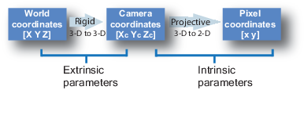
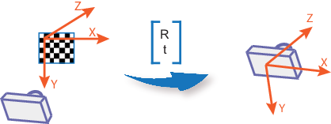
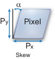

**What Is Camera Calibration?**

*Geometric camera calibration*, also referred to as *camera resectioning*, 
estimates the parameters of a lens and image sensor of an image or video camera. 

You can use these parameters to correct for lens distortion, 
measure the size of an object in world units, 
or determine the location of the camera in the scene. 

These tasks are used in applications such as machine vision to detect and measure objects. 
They are also used in robotics, for navigation systems, and 3-D scene reconstruction.

Camera parameters include **intrinsics**, **extrinsics**, and **distortion coefficients**.

To estimate the camera parameters, you need to have 3-D world points and their corresponding 2-D image points.
You can get these correspondences using multiple images of a calibration pattern, such as a **checkerboard**.
Using the correspondences, you can solve for the camera parameters. 

After you calibrate a camera, to evaluate the accuracy of the estimated parameters, you can:

  Plot the relative locations of the camera and the calibration pattern

  Calculate the reprojection errors.

  Calculate the parameter estimation errors.
  
**Camera Calibration Parameters**

The calibration algorithm calculates the camera matrix using the *extrinsic* and *intrinsic* parameters.

**->** The *extrinsic* parameters represent a rigid transformation from 3-D world coordinate system to the 3-D camera's coordinate system.

**->** The *intrinsic* parameters represent a projective transformation from the 3-D camera's coordinates into the 2-D image coordinates.

**Extrinsic Parameters**

The extrinsic parameters consist of a rotation, **R**, and a translation, **t**.
The origin of the camera's coordinate system is at its optical center and its x- and y-axis define the image plane.

**Intrinsic Parameters**

The intrinsic parameters include the focal length, the optical center, also known as the principal point, and the skew coefficient. The camera intrinsic matrix, K, is defined as:

fx    0   0
s     fy  0
cx    cy  1

The pixel skew is defined as:

