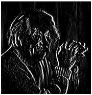

**Concept of Edge Detection**

*What are edges ?*

Sudden changes of discontinuities in an image are called as edges.

Significant transitions in an image are called as edges.

A picture with edges is shown below.

Original picture

Same picture with edges

**Types of edges**

Geenerally edges are of three types:

    Horizontal edges

    Vertical Edges

    Diagonal Edges

**Why detect edges**

Most of the shape information of an image is enclosed in edges.
So first we detect these edges in an image and by using these filters
and then by enhancing those areas of image which contains edges,
sharpness of the image will increase and image will become clearer.

Some of the Edge Detection methods I know are,

Sobel Operator
Canny

**Sobel Operator** : 
Edge points are where intensity difference between pixels is significant in an image.
There are many methods of detecting edges.

The majority methods may be grouped into these two categories:

**Gradient**: The gradient method detects the edge by looking for the maximum and minimum in the first derivative of the image. For example, Roberts, Prewitt, Sobel where features detected have sharp edges.

**Laplacian**: The Laplacian method searches for the zero crossings in the second derivative of the image to find edges
e.g. Marr-Hildreth, Laplacian of Gaussian, etc.
An edge has one-dimensional shape of a ramp and calculating the derivative of the image can highlight its location.

**Canny**

The Canny edge detection algorithm : 
The algorithm runs in five separate steps:

i.      **Smoothing**:  Blurring of the image to remove noise. Gaussian filter is used here for smoothing purpose.
ii.     **Finding gradients**:  The edges should be marked where the gradients of the image has large magnitudes(Sobel                                         operator).
iii.    **Non-maximum suppression**:    Only local maxima should be marked as edges.
iv.     **Double thresholding**:    Potential edges are determined by thresholding.
v.      **Edge tracking by hysteresis**:    Final edges are determined by suppressing all edges that are not connected to a                                                very certain (strong) edge.

